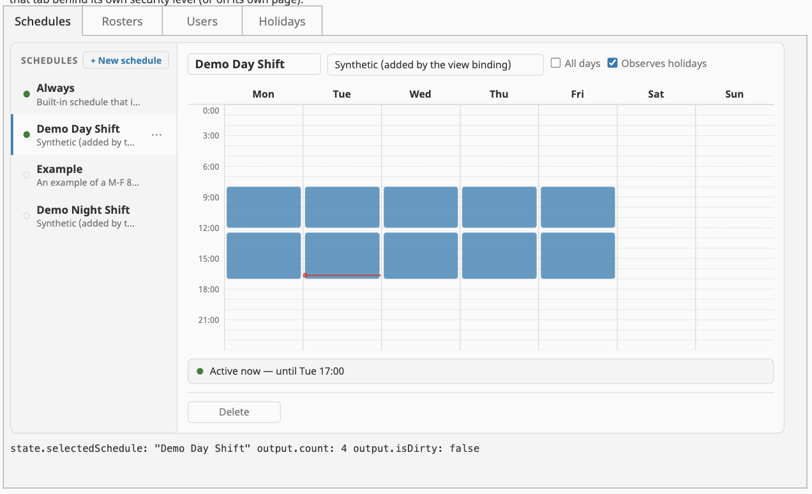
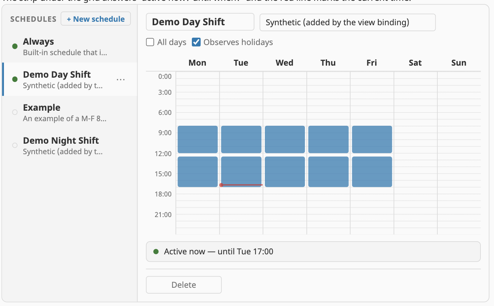
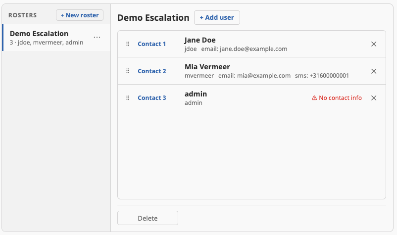
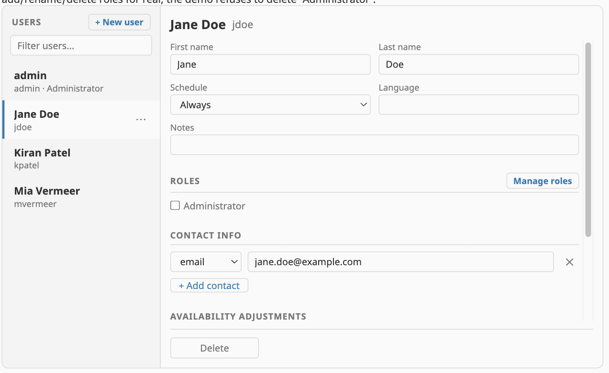
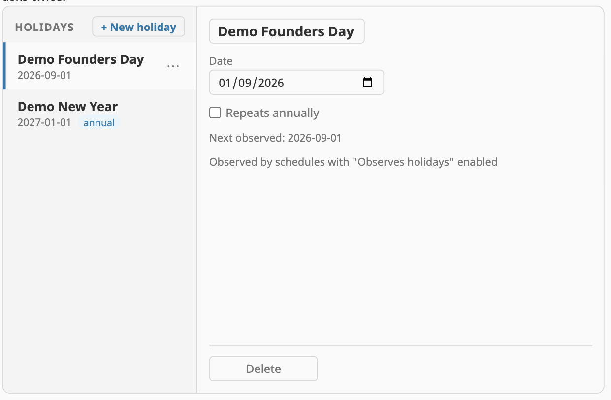

# Mustry Perspective Components — User Manual

Custom Perspective components for Ignition 8.3+. This manual covers
installation, the concepts shared by every component, and a chapter per
component. It is generated into the release PDF by
`scripts/build_manual_pdf.sh`; the Markdown source in `docs/user_manual.md`
is always the current copy.

## 1. Overview

Mustry Perspective Components adds thirteen production-grade components to
Ignition Perspective:

| Component | Palette name | What it adds |
|---|---|---|
| Date/Time Range Picker | Date/Time Range Picker | Range selection Perspective's native pickers lack |
| Calendar / Scheduler | Calendar | Month/week/day calendar with drag create/move/resize |
| Resource Timeline | Resource Timeline | Scheduling board (resources × time, drag bars) |
| Data Grid | Data Grid | Excel-like editable grid with frozen columns and validation |
| Pan & Zoom View | Pan & Zoom View | Embed any view and navigate it like a map |
| Rich Text Editor | Rich Text Editor | WYSIWYG editing for SOPs, notes, work orders |
| Code / JSON Editor | Code Editor | CodeMirror-6 editing with live JSON validation |
| Color Picker | Color Picker | Runtime colour input (HSV panel, swatches, eyedropper) |
| On-Screen Keyboard | On-Screen Keyboard | Touch keyboard that never raises the OS keyboard |
| Schedule Manager | Schedule Manager | Edit gateway user schedules by painting availability |
| Roster Manager | Roster Manager | Order alarm-escalation rosters by drag |
| User Manager | User Manager | Full user-source administration at runtime |
| Holiday Manager | Holiday Manager | Edit the gateway holiday list schedules observe |

All components appear in the Designer palette under the **Mustry
Solutions** category.

## 2. Requirements & installation

- Ignition **8.3.0 or newer** (developed and tested against 8.3.6).
- Perspective module installed.

Install `Mustry-Perspective-Components.modl` via **Gateway → Config → Modules →
Install or Upgrade a Module**, accept the license agreement and the signing
certificate, and restart is not required — components register live. Open
any Perspective view in the Designer and the components appear in the
palette.

## 3. Concepts shared by every component

### 3.1 Controlled components

The components never mutate their own bound data. Gestures and editors
fire **events** (`onChange`, `onCellEdit`, `onScheduleSave`, …) carrying the
full desired result; your event script persists it (to a database, tag, or
`system.*` call) and the binding refresh closes the loop. Every demo view in
this manual's screenshots ships a working reference script.

### 3.2 Prop sections

Every component uses the same four sections:

- **`config`** — set-and-forget behaviour and appearance.
- **`data`** — bound content (rows, events, schedules…). Item schemas are
  open: extra fields on your rows ride along untouched and come back in
  event payloads.
- **`state`** — two-way runtime state (selection, view mode, zoom). Written
  by the component on interaction; writing to it drives the component.
- **`output`** — read-only derived values (`isValid`, `isDirty`, counts).
  Bind *from* them, never into them.

### 3.3 Localisation

`config.locale` (BCP-47, e.g. `nl-NL`) selects both Intl-driven
date/weekday formatting and the built-in UI text, which ships in English,
French, German, Spanish, Dutch, Italian and Portuguese. Any single string
can be overridden via `config.labels.*` regardless of locale.

### 3.4 Theming

Each component exposes a prefixed set of CSS custom properties
(`--kbd-*`, `--cp-*`, `--adm-*`, …) whose defaults track the active
Perspective theme. Override them from a style class or project stylesheet;
they are declared on the component root so portalled panels inherit them.

### 3.5 Touch

Drag gestures use pointer events with touch-size thresholds, paint surfaces
declare `touch-action: none`, and destructive actions confirm in two steps.
The On-Screen Keyboard exists specifically so kiosk deployments can avoid
the OS keyboard entirely.

## 4. Date/Time Range Picker

Select a date or date-time **range** with a two-month calendar, presets and
manual entry. `value.start` / `value.end` are two-way; `onCommit` fires on
apply. Theming: `--dtp-*`.

## 5. Calendar / Scheduler

Month, week, day and agenda views over `data.events`. With
`config.editable` and `config.selectable`, events drag to move/resize and
empty time drags to create (`onChange` / `onSelect`); an optional built-in
editor popover covers simple cases. Categories drive colours and a legend
filter; shift boundaries can be drawn on the time axis; recurring events
are supported. Timezone-aware via `config.timezone`.

## 6. Resource Timeline

A scheduling board: resources down the side, time across, bars that drag
between resources and resize at the edges (`onChange`). Resource groups
collapse; day/week zoom levels; DST-correct. The classic
production-planning and shift-board surface.

## 7. Data Grid

An editable grid for write-back workflows: per-column editors and
validation, frozen columns, sorting/filtering, row virtualisation (tested
to thousands of rows), batch edit with a Save/Discard tail. `onCellEdit`
carries the row, column and new value; your script persists.

## 8. Pan & Zoom View

Embeds **any** Perspective view by path + params and navigates it like a
map: drag-pan (clicks inside the embedded view still work), wheel/pinch
zoom toward the cursor, home/fit controls. `state.center` / `state.zoom`
are two-way, so a script can fly the viewport to a piece of equipment on
alarm.

## 9. Rich Text Editor

TipTap-based WYSIWYG for formatted operational text: headings, lists,
tables, task lists, images (URL or library picker), fonts from an
allowlist. Draft-based with Save/Discard; `display` mode renders read-only
with live checklist write-back (`onTaskToggle`).

## 10. Code / JSON Editor

CodeMirror 6 for JSON / Python / SQL / XML / plain text. Live JSON parse
validation surfaces in a lint gutter and `output.isValid` /
`output.errorMessage` — gate your commit button on it. Format-JSON button,
folding, search, bracket matching; bound content stays out of undo history.

## 11. Color Picker

Runtime colour input: HSV area with hue/alpha bars, hex/rgb/hsl formats
switchable at runtime, bound swatch palette + recent colours, EyeDropper
where the browser supports it. Three presentations (inline panel, swatch
popover, icon button). `onChange` carries the colour in every format.

## 12. On-Screen Keyboard

A touch keyboard whose value display is a `
`, not an `<input>` — so
tapping it never summons the OS keyboard (the "double keyboard" problem).
Numeric keypad (min/max clamp, decimals, units) or QWERTY text/email/url
layouts, inline or popover. Enter commits (`onCommit {value, text,
isValid}`).

## 13. The admin family

Four components that bring Vision's gateway administration to Perspective:
schedules, rosters, users and holidays. They share one visual language
(rail + detail + footer action bar), one theming set (`--adm-*`), and one
contract: bind gateway data in, persist events out via `system.user.*` /
`system.roster.*`.

**Security note:** these components are UI only. Put them behind
Perspective security levels; the User Manager's password and role-catalog
features are opt-in flags that should stay off unless the page is
appropriately secured (see §15).

Every rail row has a **⋯ menu** (visible on hover and on the selected row)
with **Duplicate** — which opens the create flow prefilled from that row —
and a two-step **Delete**.

## 14. Schedule Manager

Master-detail over `system.user.getSchedules()`. The week grid is a paint
surface: drag empty space to add availability (snapped to
`config.snapMinutes`), drag block edges to resize, click a block to remove.
Name/description/flags edit inline; alternating (A/B) schedules render
week A read-only. The preview strip answers *"active now? until when?"*
live, and a red line marks the current time. Save fires `onScheduleSave
{schedule, isNew, oldName?}` — the payload is a 1:1 mirror of Ignition's
`BasicScheduleModel`, so persistence is a few lines of
`system.user.editSchedule`/`addSchedule`.

## 15. Roster Manager

Alarm rosters are **ordered** — the escalation sequence pipelines walk —
so rows carry *Contact 1/2/3* ordinals and reorder by dragging a grip. A
typeahead picker adds users from the bound directory; rows warn when a
user has **no contact info**. Because `system.roster` is append-only,
`onRosterSave {name, users, isNew}` carries the full desired order and the
reference script rewrites it wholesale (`removeUsers` + `addUsers` with
resolved User objects).

## 16. User Manager

A filterable user rail plus a detail form: names, schedule, language,
notes, role chips, contact rows, and **availability adjustments**
(vacation / extra cover date-ranges). Passwords are **opt-in and
payload-only** (`config.allowPasswordChange`, default off): a staged
password travels only in the `onUserSave` payload — never through props,
state or output. `config.allowRoleManagement` (default off) adds
role-catalog editing (add/rename/delete) with an inline warning that
security policies reference roles by name. AD/LDAP sources are read-only:
set `config.editable: false` for a directory viewer.

## 17. Holiday Manager

The gateway holiday list, sorted by **next occurrence** (annual repeats
compute their next date; past one-offs sink and dim). Pairs with the
Schedule Manager: schedules with *Observes holidays* enabled are inactive
on these dates. Strict calendar validation on the date field; save/delete
via `onHolidaySave` / `onHolidayDelete`.

## 18. Composing an Admin Console

Don't wait for a mega-component: place the four admin components in a
native **Tab Container** (children need `position: {tabIndex: N}`), dial
each tab with its capability flags, and put sensitive tabs behind their
own security level or page. The module's verify project ships a reference
`AdminConsole` view doing exactly this, with all tabs sharing one refresh
tick so a save in one refreshes the others.

## 19. Support

- Component reference and prop tables: `README.md` in the repository.
- Questions: sam.donche@mustrysolutions.com
